## Sobre Mi 

<br> 

::: columns
::: {.column width="40%"}
{fig-align="center"}
:::

::: {.column width="60%"}
<br>

-   Francisco Alfaro Medina 
-   Docente Universitario UTFSM
-   Lider Anlítica Avanzada UTFSM
-   Estudiante de Doctorado en Electrónica
:::
:::


## Experiencia Laboral

<br><br>

::: columns
::: {.column width="33%"}
::: {style="text-align:center;"}
<br>
**Industrial**\
WALMART, CENCOSUD, ITAU, GRUPO SECURITY, etc.
:::
:::

::: {.column .fragment width="34%"}
::: {style="text-align:center;"}
<br>
**Docente**\
UTFSM, DUOC, TRIPLETEN, CODING DOJO, etc.
:::
:::

::: {.column .fragment width="33%"}
::: {style="text-align:center;"}
<br>
**Charlista**\
CLEI, SOCHEDI, SOCHIEM, AEQUALIS, etc.
:::
:::
:::


## 

::: {style="display: flex; justify-content: center; align-items: center; height: 60vh; flex-direction: column; text-align: center;"}
[Entonces ...]{style="font-size: 1.5em"}

[Qué he aprendido estos últimos años]{style="font-size: 2em"}
:::

------------------------------------------------------------------------

## MAT281 - Matemáticas Aplicadas

<br>

::: columns
::: {.column width="40%"}
::: {style="text-align: center;"}
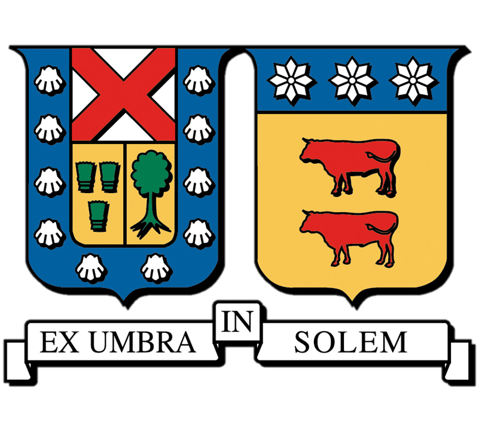
:::
:::

::: {.column .incremental width="60%" style="font-size: 0.8em"}
<br><br>

-   **Carrera**: Ingeniería Civil Matemática
-   **Objetivo**: Competencias como DS
-   **Contenidos**: Estadística, Visualización, ML
-   **Evaluaciones**: Laboratorios, Tareas, Proyecto
:::
:::

. . .

🌐 Repositorio: [github.com/fralfaro/MAT281](https://github.com/fralfaro/MAT281){style="font-size: 0.95em; color: gray align: center;"}


------------------------------------------------------------------------

##  

<br>

::: r-stack
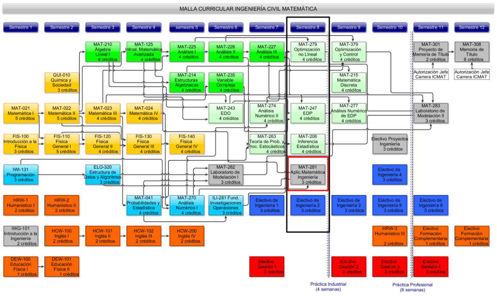{.fragment .fade-in-then-out width="100%" fig-align="center"}

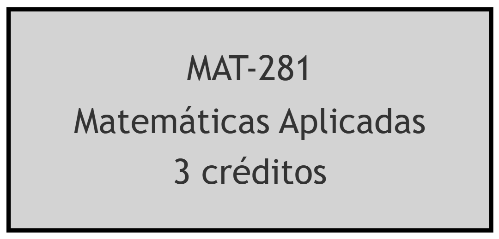{.fragment .fade-in-then-out width="100%" fig-align="center"}

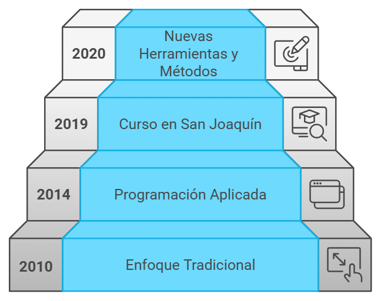{.fragment width="100%" fig-align="center"}
:::


------------------------------------------------------------------------

##  Herramientas del Curso
<br><br>

::: columns
::: {.column width="33%"}
::: {style="text-align:center;"}
<br> **Google Colab**\
Ejecutar Python en la nube
:::
:::

::: {.column .fragment width="34%"}
::: {style="text-align:center;"}
<br> **GitHub**\
Gestiona proyectos de código
:::
:::

::: {.column .fragment width="33%"}
::: {style="text-align:center;"}
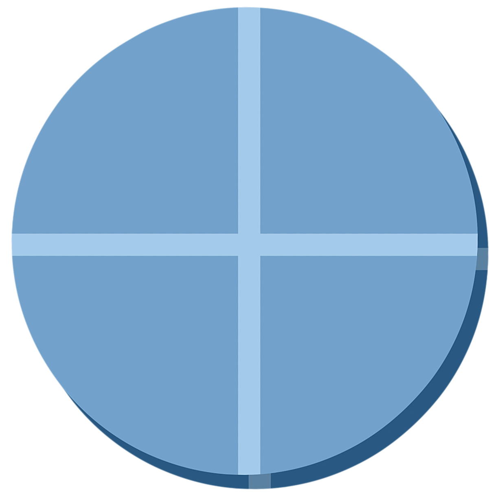<br> **Quarto**\
Crea documentos con código
:::
:::
:::

##  Herramientas del Curso
<br><br>

::: columns
::: {.column width="33%"}
::: {style="text-align:center;"}
<br> **Overleaf**\
Ejecutar LaTeX en la nube
:::
:::

::: {.column .fragment width="34%"}
::: {style="text-align:center;"}
<br> **AI**\
Uso de la IA en el aula
:::
:::

::: {.column .fragment width="33%"}
::: {style="text-align:center;"}
<br> **Data Storytelling**\
Crer historias con datos
:::
:::
:::

------------------------------------------------------------------------

##  

::: r-stack
{.fragment .fade-in-then-out fig-align="left"}

{.fragment .fade-in-then-out fig-align="center"}

{.fragment .fade-in-then-out fig-align="center"}

{.fragment .fade-in-then-out fig-align="center"}

{.fragment .fade-in-then-out fig-align="center"}

{.fragment fig-align="right"}
:::


##  

::: {style="display: flex; justify-content: center; align-items: center; height: 60vh; flex-direction: column; text-align: center;"}
[Innovación Educativa]{style="font-size: 1.5em"}

[Sobre la Enseñanza y Evaluaciones]{style="font-size: 2em"}
:::


## P1: Herramientas OpenSource 

<br>

::: columns
::: {.column width="33%"}
::: {style="text-align:center;"}
<br> **Quarto**\
Experiencia inmersiva en la creación de documentos
:::
:::

::: {.column .fragment width="34%"}
::: {style="text-align:center;"}
<br> **Google Colab**\
Aprendizaje colaborativo sin instalación

:::
:::

::: {.column .fragment width="33%"}

::: {style="text-align:center;"}
<br> **GitHub**\
Portafolio inicial con control y seguimiento
:::
:::

:::

------------------------------------------------------------------------

##

<br>

<div style="text-align:center;">

<iframe src="https://sethnut.com/talks/shiny_2025/presentacion_mat281.html#/hello-quarto-title"
  width="1200" height="700" frameborder="0" marginwidth="0" marginheight="0" scrolling="no"
  style="border:1px solid #CCC; margin-bottom:5px; max-width:100%;">
</iframe>

</div>

------------------------------------------------------------------------

## 

<br>

::: {align="center"}
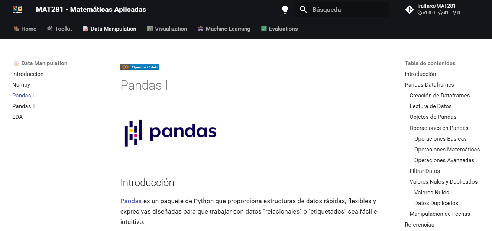
:::

------------------------------------------------------------------------

## 

<br>

::: columns
::: {.column width="50%"}
{fig-align="center" width="93%"}\
[Repositorio del Curso](https://github.com/fralfaro/MAT281)
:::

::: {.column .fragment width="50%"}
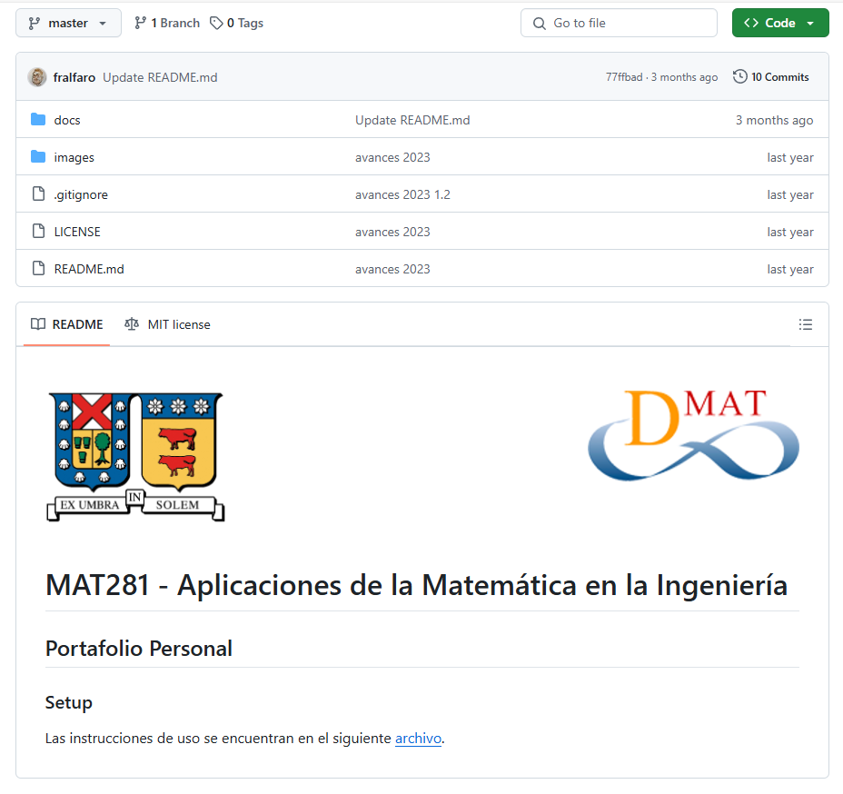{fig-align="center" width="80%"}\
[Portafolio Estudiantes](https://github.com/fralfaro/MAT281-Portfolio)
:::
:::

------------------------------------------------------------------------

## P2: Evaluaciones Innovadoras

<br>

::: columns
::: {.column width="50%"}
::: {style="text-align:center;"}
<br> **Evaluaciones**\
Evaluaciones prácticas y colaborativas para el trabajo
:::
:::

::: {.column .fragment width="50%"}
::: {style="text-align:center;"}
<br> **Feedback**\
Proyectos y feedback que fortalecen habilidades
:::
:::
:::

------------------------------------------------------------------------

## 

<br>

::: r-stack
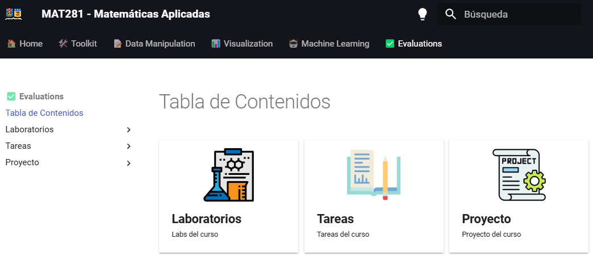{.fragment .fade-in-then-out width="100%" fig-align="center"}

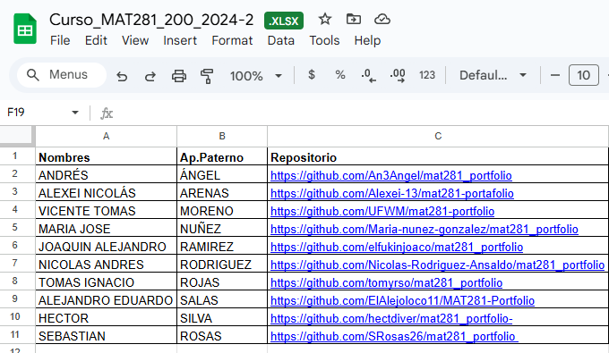{.fragment .fade-in-then-out width="100%" fig-align="center"}

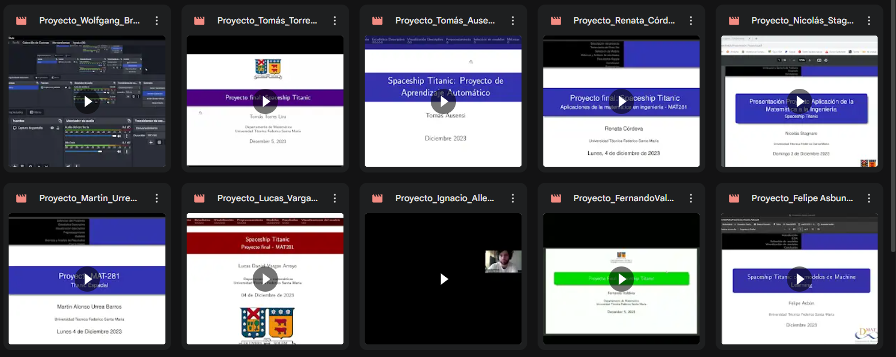{.fragment .fade-in-then-out width="100%" fig-align="center"}

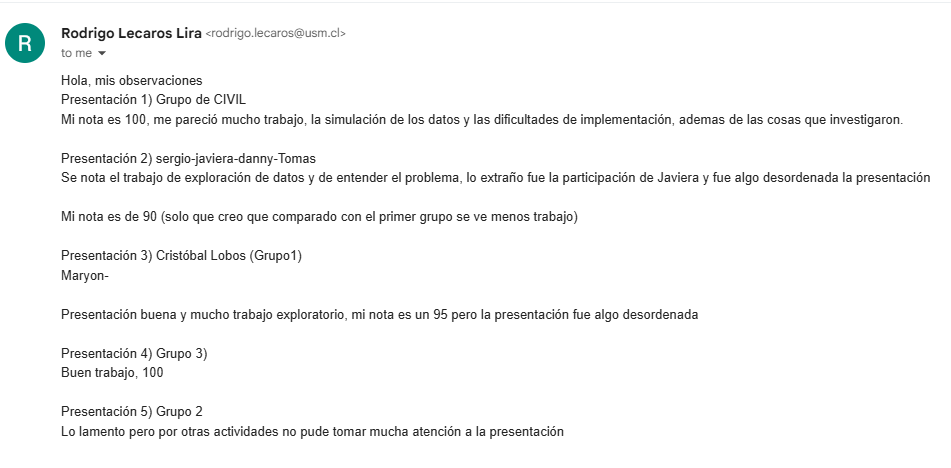{.fragment width="100%" fig-align="center"}
:::

##


<div style="text-align:center;">

<iframe src="https://www.slideshare.net/slideshow/embed_code/key/BEuTmw4Irb1Viv?hostedIn=slideshare&amp;page=upload"
  width="900" height="700" frameborder="0" marginwidth="0" marginheight="0" scrolling="no"
  style="border:1px solid #CCC; margin-bottom:5px; max-width:100%;">
</iframe>

</div>

------------------------------------------------------------------------

##  

::: {style="display: flex; justify-content: center; align-items: center; height: 60vh; flex-direction: column; text-align: center;"}
[Retroalimentación]{style="font-size: 1.5em"}

[Perspectiva de los Estudiantes]{style="font-size: 2em"}
:::

------------------------------------------------------------------------

## Comentarios de los Participantes 

<br><br>

::: columns
::: {.column .fragment width="50%"}
::: {.callout-important title="Negativos"}
-   Poca respuesta a dudas por correo\
-   Falta de retroalimentación y notas\
-   Evaluaciones poco claras\
-   Contenido teórico algo extenso\
-   Tiempo insuficiente para preguntas\
:::
:::

::: {.column .fragment width="50%"}
::: {.callout-note title="Positivos"}
-   Profesor claro y con buena disposición\
-   Explicaciones ordenadas y confiables\
-   Contenido práctico y aplicable\
-   Curso bien estructurado en Data Science\
-   Ambiente positivo de aprendizaje\
:::
:::
:::

------------------------------------------------------------------------

## Evaluaciones 

<br>

::: r-stack
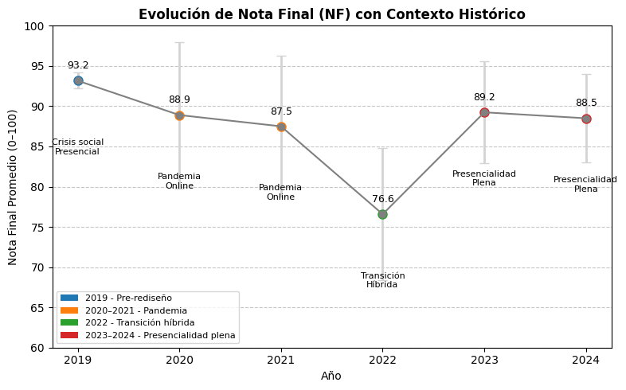{.fragment .fade-in-then-out width="100%" fig-align="center"}

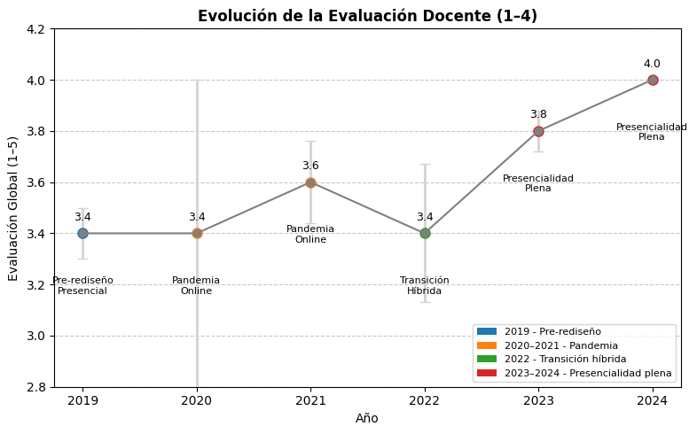{.fragment width="100%" fig-align="center"}
:::

. . .

[(C) La evaluó: contenidos, cercanía, y fomarlidades del curso.]{style="font-size: 0.7em; color: gray"}

------------------------------------------------------------------------

##  

::: {style="display: flex; justify-content: center; align-items: center; height: 60vh; flex-direction: column; text-align: center;"}
[Conclusiones]{style="font-size: 1.5em"}

[Resultados y Reflexiones del Curso MAT281]{style="font-size: 2em"}
:::

------------------------------------------------------------------------

##  

<br>

::: columns
::: {.column .fragment width="50%"}
::: {style="text-align:center;"}
<br> **Conclusiones**\
Herramientas abiertas motivan, mejora la comprensión práctica\
y ofrece flexibilidad en el aprendizaje
:::
:::

::: {.column .fragment .fragment width="50%"}
::: {style="text-align:center;"}
<br> **Trabajos Futuros**\
Integrar Inteligencia Artificial, expandir la metodología, proyectos con la industria\
y automatizar evaluaciones
:::
:::
:::

------------------------------------------------------------------------

## 🎉 Agradecimientos 

::: r-stack
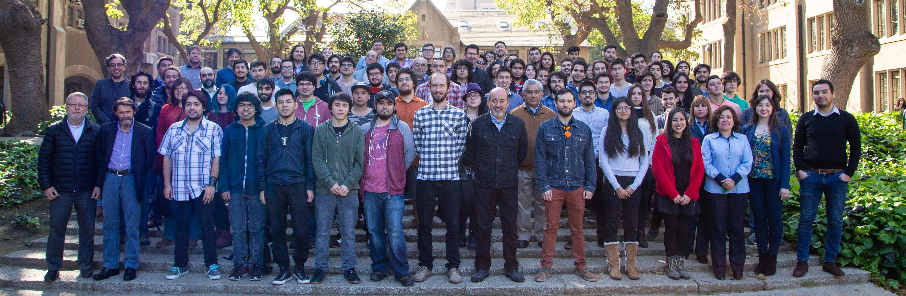{.fragment .fade-in-then-out fig-align="center" width="100%"}

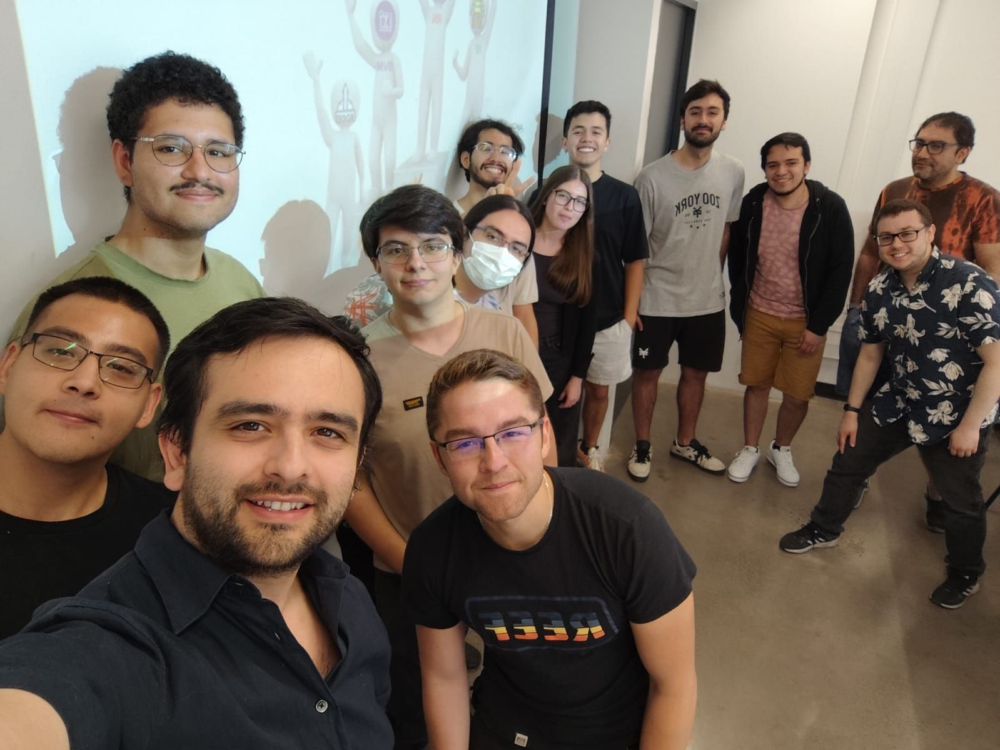{.fragment width="65%" fig-align="center"}
:::


------------------------------------------------------------------------

## 🎉 ¡Gracias por Participar! 

::: columns
::: {.column width="50%"}
<br>

❓¿Preguntas?

👏 Responder [encuesta](https://docs.google.com/forms/d/e/1FAIpQLSd2CseqhHUjdmvr46ZDb_Aa2iUYEjLAIE4MwLztled5ytRJvg/viewform?usp=dialog)

🥳 Disfrutar del Evento!
:::

::: {.column width="50%" align="center"}
{width="400"}
:::
:::

> 🔗 Nuestro Sitio Web: [sethnut.com/talks](https://sethnut.com/talks/)

```{=html}
<style>
/* Ajusta el tamaño del título y subtítulo */
.reveal .slides h1 {
  font-size: 2em; /* Tamaño más pequeño para el título */
}

.reveal .slides h2 {
  font-size: 1.5em; /* Tamaño más pequeño para el subtítulo */
}

/* Ajusta el tamaño del texto en los párrafos */
.reveal .slides p {
  font-size: 0.8em; /* Texto más pequeño */
}

/* Ajusta el tamaño de las tablas */
.reveal .slides table {
  font-size: 0.8em; /* Tamaño de fuente más pequeño en las tablas */
  width: 90%; /* Ajusta el ancho de la tabla */
  margin: 0 auto; /* Centra la tabla */
}

/* Ajusta el tamaño de los bullets */
.reveal .slides ul {
  font-size: 0.8em; /* Tamaño de fuente más pequeño en los bullets */
}

.reveal .slide-logo {
   max-height: 2em !important;
}
</style>
```