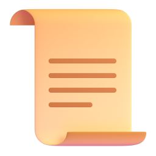

## Objetivos

<br>

::: columns
::: {.column width="40%"}
::: {style="text-align: center;"}

:::
:::

::: {.column .incremental width="60%"}
<br>

- Entender que es GitHub y por que se usa en educacion y trabajo.
- Conocer un poco de su historia y ecosistema.
- Crear una cuenta y configurar el perfil.
- Crear tu primer repositorio y un proyecto basico.
- Aprender un flujo minimo: editar, guardar cambios y publicar.
:::
:::

------------------------------------------------------------------------

## GitHub en una frase

::: {style="font-size:1.25em; text-align:center; margin-top:2em;"}
GitHub es una plataforma para colaborar en proyectos, versionar archivos y publicar trabajo tecnico.
:::

. . .

::: {.callout-note}
Piensalo como una mezcla de: Google Drive + historial de cambios + trabajo en equipo.
:::

------------------------------------------------------------------------

## Que es Git y que es GitHub

<br>

| Concepto | Idea clave |
|---|---|
| **Git** | Sistema de control de versiones creado por Linus Torvalds (2005). |
| **GitHub** | Plataforma web (nace en 2008) que usa Git para colaborar y compartir repositorios. |
| **Repositorio** | Carpeta de proyecto con historial completo de cambios. |

. . .

> Git es la tecnologia. GitHub es la plataforma social y colaborativa sobre esa tecnologia.

------------------------------------------------------------------------

## Un poco de historia

<br>

- 2005: nace **Git** para el desarrollo del kernel de Linux.
- 2008: nace **GitHub** como plataforma para alojar repositorios Git.
- 2018: Microsoft adquiere GitHub.
- Hoy: estandar de facto para portafolios, colaboracion y proyectos open source.

------------------------------------------------------------------------

## Para que sirve GitHub

<br>

::: columns
::: {.column width="33%"}
::: {style="text-align:center;"}
<br>
**Versionar**\
Volver atras si algo se rompe.
:::
:::

::: {.column .fragment width="34%"}
::: {style="text-align:center;"}
<br>
**Colaborar**\
Trabajar con otras personas sin pisarse cambios.
:::
:::

::: {.column .fragment width="33%"}
::: {style="text-align:center;"}
<br>
**Portafolio**\
Mostrar proyectos, tareas e investigaciones.
:::
:::
:::

------------------------------------------------------------------------

## Crear una cuenta (paso a paso)

<br>

1. Entrar a [github.com](https://github.com/).
2. Clic en **Sign up**.
3. Registrar email, contrasena y nombre de usuario.
4. Verificar email.
5. Completar perfil basico: nombre, bio corta, foto.

. . .

::: {.callout-tip}
Usa un usuario profesional (ej: `nombre-apellido` o `inicialapellido`).
:::

------------------------------------------------------------------------

## Configuracion minima recomendada

<br>

- Activar autenticacion de dos factores (2FA).
- Agregar foto y descripcion corta.
- Fijar zona horaria y email principal.
- Crear README de perfil (opcional, pero recomendado).

------------------------------------------------------------------------

## Tu primer repositorio

<br>

1. Clic en **New repository**.
2. Nombre sugerido: `mi-primer-repo`.
3. Marcar **Add a README file**.
4. Elegir visibilidad:
   - **Public**: visible para todos.
   - **Private**: solo invitados.
5. Clic en **Create repository**.

------------------------------------------------------------------------

## Estructura inicial sugerida

```text
mi-primer-repo/
|- README.md
|- .gitignore
|- entregables/
`- recursos/
```

. . .

> `README.md` explica de que trata el proyecto y como usarlo.

------------------------------------------------------------------------

## Crear un proyecto en GitHub (tablero)

<br>

- Ir a pestana **Projects** en tu perfil u organizacion.
- Clic en **New project**.
- Elegir plantilla: **Board** o **Table**.
- Crear columnas tipicas:
  - `Por hacer`
  - `En progreso`
  - `Hecho`

. . .

Esto ayuda a gestionar tareas del curso o avances de un equipo.

------------------------------------------------------------------------

## Flujo minimo de trabajo

<br>

1. Editar archivo en GitHub (o local).
2. Guardar cambio con mensaje claro (**commit**).
3. Subir cambios al repositorio (**push**).
4. Revisar historial y continuar.

------------------------------------------------------------------------

## Buenas practicas desde el dia 1

<br>

- Commits pequenos y con mensajes claros.
- Un `README.md` corto pero util.
- Carpetas con nombres consistentes.
- Issues para registrar pendientes.
- No subir credenciales ni archivos sensibles.

------------------------------------------------------------------------

## Actividad guiada (10-15 min)

<br>

1. Crear cuenta (si aun no tienes).
2. Crear repositorio `portafolio-docencia`.
3. Escribir un `README.md` con:
   - Nombre
   - Objetivo del repositorio
   - Secciones del curso
4. Crear carpeta `entregables/`.
5. Subir un archivo de prueba.

------------------------------------------------------------------------

## Recursos recomendados

<br>

- [GitHub Skills](https://skills.github.com/)
- [Documentacion oficial de GitHub](https://docs.github.com/)
- [GitHub Education](https://education.github.com/)
- [Hello World en GitHub Docs](https://docs.github.com/en/get-started/start-your-journey/hello-world)

------------------------------------------------------------------------

## Cierre

::: {style="display: flex; justify-content: center; align-items: center; height: 60vh; flex-direction: column; text-align: center;"}
[GitHub no es solo para programadores]{style="font-size: 1.3em"}

[Es una herramienta de trabajo academico, colaboracion y portafolio profesional]{style="font-size: 1.6em"}
:::

------------------------------------------------------------------------

## Gracias por Participar

::: columns
::: {.column width="50%"}
<br>

Preguntas?

Responder [encuesta](https://docs.google.com/forms/d/e/1FAIpQLSd2CseqhHUjdmvr46ZDb_Aa2iUYEjLAIE4MwLztled5ytRJvg/viewform?usp=dialog)

A crear tu primer repo!
:::

::: {.column width="50%" align="center"}
{width="400"}
:::
:::

> Sitio: [sethnut.com/talks](https://sethnut.com/talks/)

```{=html}
<style>
.reveal .slides h1 { font-size: 2em; }
.reveal .slides h2 { font-size: 1.5em; }
.reveal .slides p  { font-size: 0.9em; }
.reveal .slides table { font-size: 0.85em; width: 90%; margin: 0 auto; }
.reveal .slides ul { font-size: 0.9em; }
.reveal .slide-logo { max-height: 2em !important; }
</style>
```
