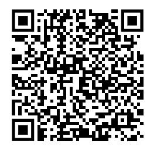

## Objetivos

<br>

::: columns
::: {.column width="40%"}
::: {style="text-align: center;"}

:::
:::

::: {.column .incremental width="60%"}
<br>

- Entender que es IA y por que importa en educacion.
- Revisar una historia breve (hitos clave).
- Distinguir tipos de herramientas de IA.
- Explorar herramientas utiles para docentes.
- Definir buenas practicas para uso responsable.
:::
:::

------------------------------------------------------------------------

## IA en una frase

::: {style="font-size:1.25em; text-align:center; margin-top:2em;"}
La IA son sistemas que realizan tareas cognitivas: comprender texto, generar contenido, clasificar, predecir y asistir decisiones.
:::

. . .

::: {.callout-note}
En docencia, su valor no es reemplazar al profesor: es ampliar su capacidad de diseno, retroalimentacion y personalizacion.
:::

------------------------------------------------------------------------

## Historia breve de la IA

<br>

- 1950: Alan Turing propone la pregunta "pueden pensar las maquinas?".
- 1956: conferencia de Dartmouth, nace el termino "Artificial Intelligence".
- 1980s: auge de sistemas expertos.
- 1997: Deep Blue vence a Kasparov.
- 2012: salto en deep learning (AlexNet).
- 2017: arquitectura Transformer.
- 2022-2026: masificacion de IA generativa para texto, imagen, audio y codigo.

------------------------------------------------------------------------

## Que cambio en educacion

<br>

::: columns
::: {.column width="33%"}
::: {style="text-align:center;"}
<br>
**Preparacion**\
Planificaciones, rubricas, guias, evaluaciones.
:::
:::

::: {.column .fragment width="34%"}
::: {style="text-align:center;"}
<br>
**Aprendizaje activo**\
Tutorias, ejemplos guiados, explicaciones multinivel.
:::
:::

::: {.column .fragment width="33%"}
::: {style="text-align:center;"}
<br>
**Feedback**\
Retroalimentacion mas rapida y personalizada.
:::
:::
:::

------------------------------------------------------------------------

## Tipos de herramientas IA para docentes

<br>

| Tipo | Ejemplos | Uso docente |
|---|---|---|
| **Chat generalista** | ChatGPT, Gemini, Claude | Planificacion, ideas de actividades, materiales. |
| **Asistente sobre fuentes** | NotebookLM | Resumen, FAQ, guia de estudio desde tus documentos. |
| **Presentaciones y diseno** | Canva Magic, Gamma | Diapositivas y visuales para clase. |
| **Video y voz** | ElevenLabs, CapCut AI | Microcapsulas, narraciones, recursos multimedia. |
| **Codigo y datos** | GitHub Copilot, Colab AI | Apoyo en notebooks, ejemplos y explicaciones de codigo. |

------------------------------------------------------------------------

## ChatGPT, Gemini y Claude (vista rapida)

<br>

::: columns
::: {.column width="33%"}
**ChatGPT**

- Muy versatil para docencia general.
- Bueno en estructura didactica y actividades.
- Util para crear variantes de ejercicios.
:::

::: {.column .fragment width="34%"}
**Gemini**

- Integracion natural con ecosistema Google.
- Flujo util con Docs, Drive y Classroom.
- Fuerte para equipos que ya usan Google Workspace.
:::

::: {.column .fragment width="33%"}
**Claude**

- Buen desempeno en analisis de texto largo.
- Muy util para revision de documentos extensos.
- Ecosistema interesante con MCP en flujos avanzados.
:::
:::

------------------------------------------------------------------------

## NotebookLM para docentes

<br>

- Cargas tus propias fuentes: PDF, apuntes, guias, enlaces.
- Genera resumenes, preguntas frecuentes y lineas de tiempo.
- Permite crear guias de estudio basadas en material oficial del curso.
- Reduce alucinaciones al trabajar sobre fuentes definidas.

. . .

::: {.callout-tip}
Caso de uso: subir programa + clases + evaluaciones antiguas y pedir una guia de repaso por unidad.
:::

------------------------------------------------------------------------

## Claude + MCP (idea general)

<br>

- MCP = protocolo para conectar el asistente con herramientas externas.
- Permite que el chat consulte fuentes, repositorios o sistemas especificos.
- En docencia, puede servir para:
  - buscar contenidos institucionales,
  - consultar repositorios de curso,
  - automatizar flujos de apoyo academico.

. . .

> Recomendacion: partir simple (chat + documentos) y escalar a MCP solo cuando el flujo ya este claro.

------------------------------------------------------------------------

## Otras herramientas utiles para docentes

<br>

1. **Perplexity**: investigacion rapida con citas y contraste de fuentes.
2. **Canva Magic Studio**: material visual para clases y redes academicas.
3. **Gamma**: borradores de presentaciones desde prompts.
4. **Elicit**: apoyo para revision de literatura.
5. **Wolfram|Alpha**: consultas matematicas y cientificas guiadas.
6. **Khanmigo / tutores IA**: apoyo para aprendizaje personalizado (segun contexto institucional).

------------------------------------------------------------------------

## Prompting docente: plantilla util

```text
Actua como apoyo pedagogico para [asignatura] en [nivel].
Objetivo de la clase: [objetivo].
Duracion: [minutos].
Perfil del estudiantado: [contexto].
Genera:
1) apertura (5 min),
2) actividad central,
3) evaluacion formativa,
4) cierre,
5) rubrica breve.
Incluye adaptaciones para estudiantes con distintos ritmos.
```

------------------------------------------------------------------------

## Ejemplos de prompts para clase

<br>

- "Genera 3 actividades activas sobre derivadas, con dificultad creciente y criterios de logro."
- "Transforma este texto tecnico en una explicacion para primer ano universitario."
- "Crea una rubrica de 4 niveles para evaluar un informe de laboratorio."
- "Dame 5 preguntas tipo quiz con retroalimentacion inmediata."

------------------------------------------------------------------------

## Riesgos y limites (hay que explicitar)

<br>

- Puede inventar datos o referencias (alucinacion).
- Puede tener sesgos en respuestas.
- No siempre cita fuentes de forma confiable.
- Riesgo de dependencia si no hay diseno pedagogico.
- Privacidad: no subir datos sensibles o personales.

------------------------------------------------------------------------

## Marco de uso responsable en aula

<br>

1. Transparencia: declarar cuando se uso IA.
2. Verificacion: contrastar datos con fuentes confiables.
3. Trazabilidad: guardar prompts y version final.
4. Evaluacion autentica: pedir proceso, no solo producto.
5. Proteccion de datos: anonimizar informacion de estudiantes.

------------------------------------------------------------------------

## Actividad guiada (15 min)

<br>

1. Elegir una unidad de tu curso.
2. Probar 1 chat (ChatGPT/Gemini/Claude) con la plantilla de prompt.
3. Probar NotebookLM con 1-2 documentos del curso.
4. Comparar resultados: calidad, tiempo, utilidad.
5. Definir una regla de uso IA para tus estudiantes.

------------------------------------------------------------------------

## Plan de adopcion docente (simple)

<br>

- Semana 1: usar IA para planificacion de clase.
- Semana 2: usar IA para crear quiz y rubricas.
- Semana 3: usar IA para feedback formativo.
- Semana 4: evaluar impacto (tiempo ahorrado + calidad percibida).

------------------------------------------------------------------------

## Cierre

::: {style="display: flex; justify-content: center; align-items: center; height: 60vh; flex-direction: column; text-align: center;"}
[La IA ya es parte del ecosistema educativo]{style="font-size: 1.3em"}

[La diferencia la marca el criterio pedagogico del docente]{style="font-size: 1.7em"}
:::

------------------------------------------------------------------------

## Gracias por Participar

::: columns
::: {.column width="50%"}
<br>

Preguntas?

Responder [encuesta](https://docs.google.com/forms/d/e/1FAIpQLSd2CseqhHUjdmvr46ZDb_Aa2iUYEjLAIE4MwLztled5ytRJvg/viewform?usp=dialog)

A experimentar con IA en tu proxima clase!
:::

::: {.column width="50%" align="center"}
{width="350"}
:::
:::

> Sitio: [sethnut.com/talks](https://sethnut.com/talks/)

```{=html}
<style>
.reveal .slides h1 { font-size: 2em; }
.reveal .slides h2 { font-size: 1.5em; }
.reveal .slides p  { font-size: 0.9em; }
.reveal .slides table { font-size: 0.82em; width: 95%; margin: 0 auto; }
.reveal .slides ul { font-size: 0.9em; }
.reveal .slide-logo { max-height: 2em !important; }
</style>
```
