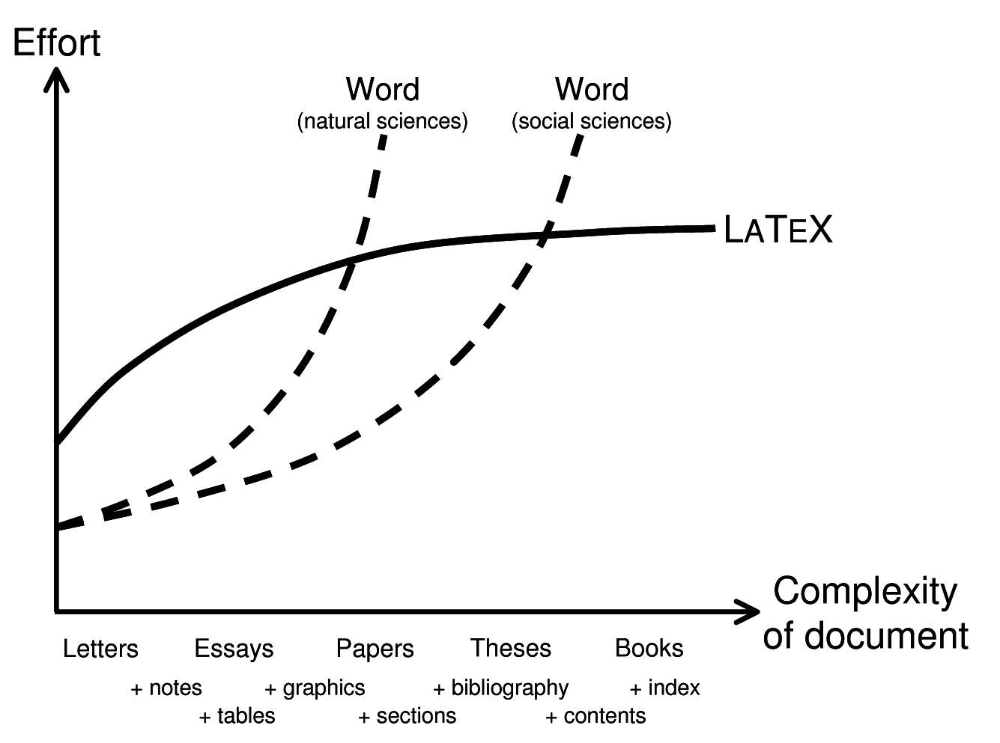
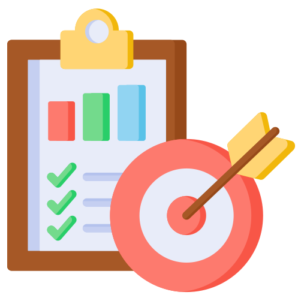
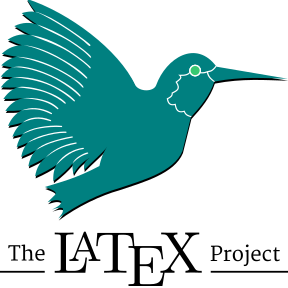
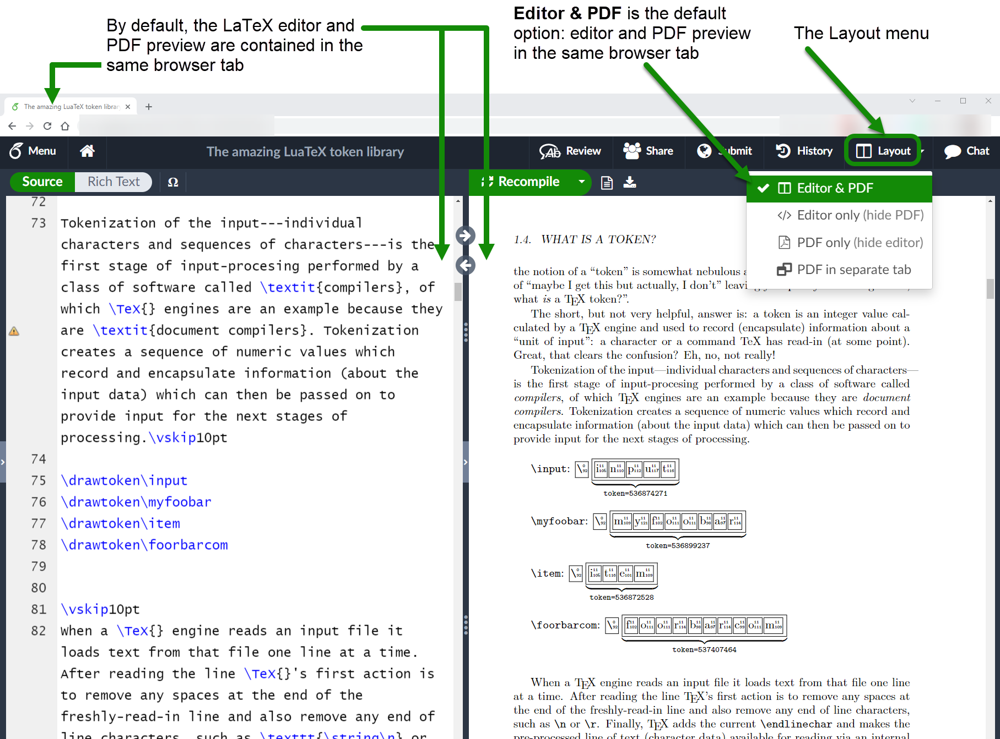
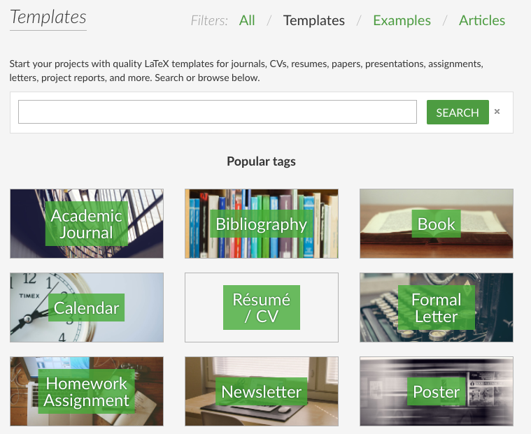
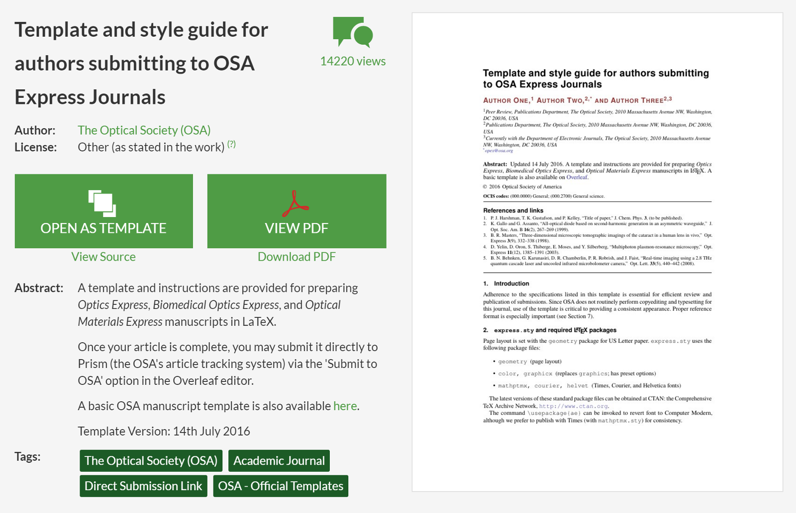
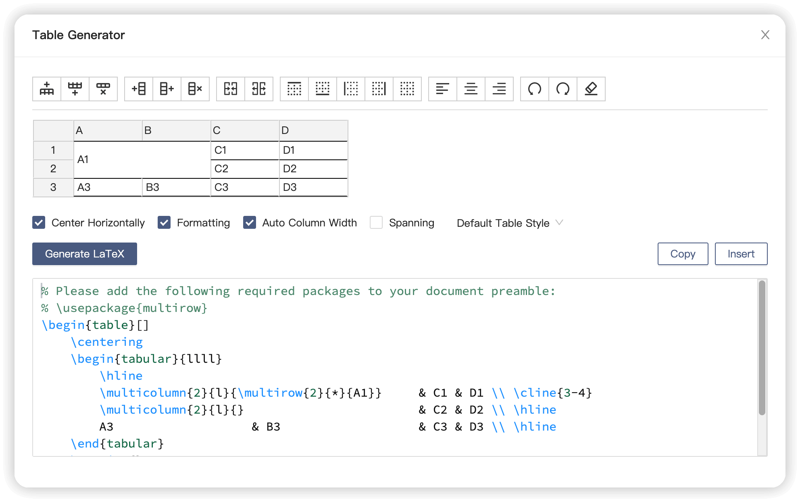
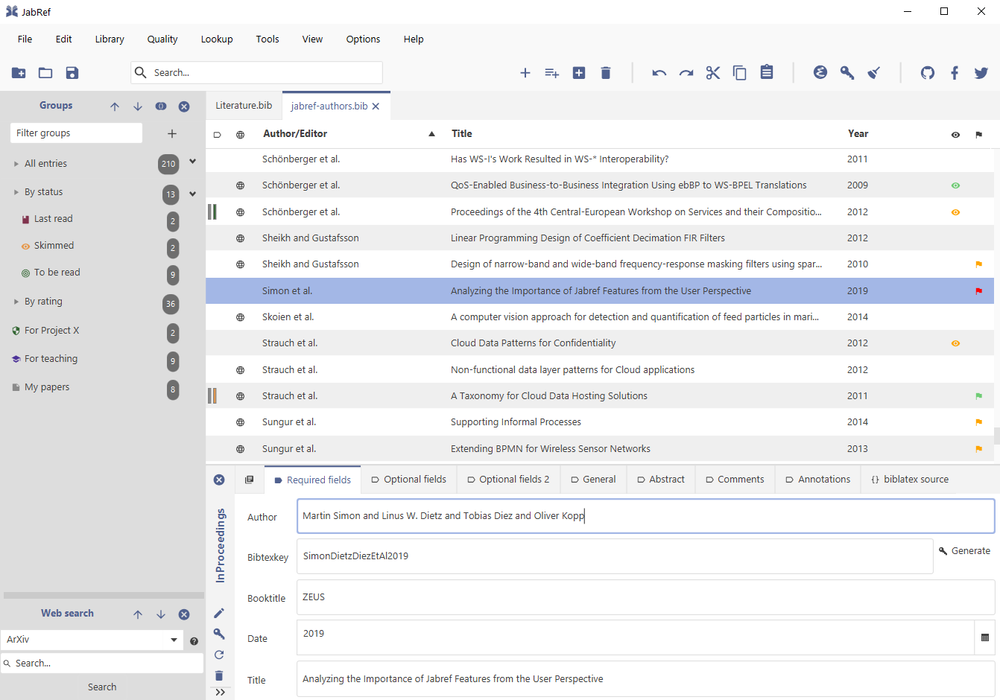

## ¿Te ha pasado esto?

::: r-stack
<br>

{.fragment .fade-in-then-out fig-align="center" width="45%"}

{.fragment .fade-in-then-out fig-align="center" width="45%"}

{.fragment fig-align="center" width="70%"}
:::

------------------------------------------------------------------------

## Objetivos

<br>

::: columns
::: {.column width="40%"}
::: {style="text-align: center;"}

:::
:::

::: {.column .incremental width="60%"}
<br>

-   **Conocer LaTeX**: Qué es y por qué usarlo frente a otros editores.\
-   **Primeros pasos**: Crear, compilar y estructurar un documento básico.\
-   **Elementos clave**: Texto, secciones, listas, imágenes y fórmulas.\
-   **Buenas prácticas**: Organización, plantillas y recursos recomendados.
:::
:::

------------------------------------------------------------------------

## 

::: {style="display: flex; justify-content: center; align-items: center; height: 60vh; flex-direction: column; text-align: center;"}
[LaTeX]{style="font-size: 1.5em"}

[¿Qué es y por qué usarlo?]{style="font-size: 1.5em"}
:::

------------------------------------------------------------------------

## ¿Qué es LaTeX?

::: columns
::: {.column width="40%"}
::: {style="text-align: center;"}

:::
:::

::: {.column .incremental width="60%"}
<br>

-   **¿Qué es LaTeX?**
    -   Sistema para crear documentos académicos y científicos con formato profesional.
-   **Ventajas**:
    -   Automatiza referencias, citas y ecuaciones.\
    -   Control total sobre formato y estructura.\
    -   Ideal para documentos extensos y complejos.
:::
:::

------------------------------------------------------------------------

## 

<br>

::: r-stack
::: {.fragment .fade-in-then-out}
<iframe src="https://www.slideshare.net/slideshow/embed_code/key/6iH5QPCL3w1qwm?startSlide=1" width="960" height="600" frameborder="0" scrolling="no" style="max-width:100%; border:1px solid #CCC; border-radius:10px;" allowfullscreen>

</iframe>
:::

::: {.fragment .fade-in-then-out}
<iframe src="https://www.slideshare.net/slideshow/embed_code/key/eUNDWTAdYMfD7M?hostedIn=slideshare&amp;page=upload" width="960" height="600" frameborder="0" scrolling="no" style="max-width:100%; border:1px solid #CCC; border-radius:10px;" allowfullscreen>

</iframe>
:::

::: fragment
<iframe src="https://www.slideshare.net/slideshow/embed_code/key/tkQohqCfNlexT1?startSlide=1" width="960" height="600" frameborder="0" scrolling="no" style="max-width:100%; border:1px solid #CCC; border-radius:10px;" allowfullscreen>

</iframe>
:::
:::

------------------------------------------------------------------------

## ¿Cómo empezar?

::: columns
::: {.column width="40%"}
::: {style="text-align: center;"}

:::
:::

::: {.column .incremental width="60%"}
<br>

-   **Editor recomendado:**
    -   [Overleaf](https://www.overleaf.com/) *(en línea, sin instalación)*
-   **Instalaciones locales:**
    -   [TeX Live](https://www.tug.org/texlive/), [MiKTeX](https://miktex.org/), [MacTeX](https://tug.org/mactex/)
-   **Editores útiles:**
    -   [TeXstudio](https://www.texstudio.org/), [VSCode + LaTeX Workshop](https://marketplace.visualstudio.com/items?itemName=James-Yu.latex-workshop)\
:::
:::

. . .

> 🌿 En este taller nos centraremos en [Overleaf](https://www.overleaf.com/), fácil y en línea.

------------------------------------------------------------------------

## Overleaf: LaTeX Online

::: columns
::: {.column width="40%"}
::: {style="text-align: center;"}

:::
:::

::: {.column .incremental width="60%"}
<br>

-   **¿Qué es?**
    -   Plataforma en línea para escribir y compilar documentos en LaTeX sin instalación.
-   **¿Por qué usarlo?**
    -   Edición colaborativa en tiempo real.\
    -   Integración con GitHub y la nube.\
    -   Compilación y previsualización instantánea.\
:::
:::

. . .

> 🌿 Para este taller, crea tu cuenta gratuita en [Overleaf](https://www.overleaf.com/).

------------------------------------------------------------------------

## 

::: r-stack
<br>

{.fragment .fade-in-then-out fig-align="center" width="90%"}

{.fragment fig-align="center" width="75%"}
:::

------------------------------------------------------------------------

## 

::: {style="display: flex; justify-content: center; align-items: center; height: 60vh; flex-direction: column; text-align: center;"}
[LaTeX]{style="font-size: 1em"}

[Manos a la Obra]{style="font-size: 1.5em"}
:::

------------------------------------------------------------------------

## Actividad: Artículo en Overleaf

<br>

::: columns
::: {.column width="40%"}
::: {style="text-align: center;"}

:::
:::

::: {.column .incremental width="60%"}
1.  **Nuevo proyecto en Overleaf**.
2.  **Copia** la [plantilla](https://www.overleaf.com/read/qfrqrpxfqhkj#f66dd7).
3.  **Edita**: título, texto e imágenes.
4.  **Compila** y revisa.
5.  *(Extra)* Añade cita y bibliografía.
:::
:::

. . .

> ⏱️ Tiempo de la actividad: 05-10 minutos.

------------------------------------------------------------------------

## 

::: {style="display: flex; justify-content: center; align-items: center; height: 60vh; flex-direction: column; text-align: center;"}
[LaTeX]{style="font-size: 1em"}

[Explora y aprende con plantillas]{style="font-size: 1.5em"}
:::

------------------------------------------------------------------------

## Overleaf Gallery

::: columns
::: {.column width="40%"}
::: {style="text-align: center;"}

:::
:::

::: {.column .incremental width="60%"}
<br>

-   **Plantillas listas para usar**:
    -   Artículos, tesis, pósters y presentaciones.
-   **Aprende explorando**:
    -   Abre una plantilla y estudia su código.
-   **Personaliza y reutiliza**:
    -   Cambia texto, imágenes y estilo.
:::
:::

. . .

> 🌿 Veamos algunos ejemplos en [Overleaf Gallery](https://www.overleaf.com/gallery).

------------------------------------------------------------------------

## 

::: r-stack
<br>

{.fragment .fade-in-then-out fig-align="center" width="90%"}

{.fragment fig-align="center" width="75%"}
:::

------------------------------------------------------------------------

## 

::: {style="display: flex; justify-content: center; align-items: center; height: 60vh; flex-direction: column; text-align: center;"}
[LaTeX]{style="font-size: 1.5em"}

[Más Herramientas]{style="font-size: 1.5em"}
:::

------------------------------------------------------------------------

## Herramientas Útiles

::: columns
::: {.column width="45%"}
::: {style="text-align: center;"}

:::
:::

::: {.column .incremental width="55%"}
<br>

-   📊 [**Tables Generator**](https://www.tablesgenerator.com/)\
    Crea y exporta fácilmente tablas en formato LaTeX.

-   🔢 [**LaTeX Equation Editor**](https://editor.codecogs.com/)\
    Genera ecuaciones LaTeX en tiempo real.

-   🧾 [**BibTeX Editor**](https://truben.no/latex/bibtex/)\
    Crea referencias bibliográficas en formato BibTeX.

-   🧠 [**Detexify**](http://detexify.kirelabs.org/classify.html)\
    Dibuja un símbolo y encuentra su comando LaTeX.
:::
:::

------------------------------------------------------------------------

## 

::: r-stack
{.fragment .fade-in-then-out fig-align="center" width="85%"}

{.fragment .fade-in-then-out fig-align="center" width="80%"}

{.fragment .fade-in-then-out fig-align="center" width="80%"}

{.fragment fig-align="center" width="85%"}
:::

------------------------------------------------------------------------

## LaTeX + Inteligencia Artificial

::: columns
::: {.column width="40%"}
::: {style="text-align: center;"}

:::
:::

::: {.column .incremental width="60%"}
<br><br>

-   [**ChatGPT**](https://chat.openai.com/), [**Gemini**](https://gemini.google.com/), [**DeepSeek**](https://www.deepseek.com/):

    -   Generan y corrigen código LaTeX.
    -   Crean ecuaciones, tablas y bibliografía.
    -   Explican comandos y paquetes.
    -   Mejoran el formato y detectan errores.
:::
:::

. . .

> [🤖 **Consejo**: usa prompts claros, incluye tu código y pide explicaciones paso a paso.]{style="font-size:0.85em;"}

------------------------------------------------------------------------

## Ejemplos de Prompts

::: panel-tabset
## Fórmulas

::: columns
::: {.column width="50%"}
✨ **Prompt:**

"Escríbeme la fórmula de la función cuadrática en LaTeX."
:::

::: {.column .incremental width="50%"}
✅ **Esperado:**

¡Por supuesto! Aquí tienes la **fórmula cuadrática** escrita en **LaTeX**:

``` latex
x = \frac{-b \pm \sqrt{b^2 - 4ac}}{2a}
```
:::
:::

## Estructuración

::: columns
::: {.column width="50%"}
✨ **Prompt:**

“Haz una tabla de derivadas básicas en LaTeX (función vs. derivada)."
:::

::: {.column .incremental width="50%"}
✅ **Esperado:**

``` latex
\begin{tabular}{|c|c|}
\hline
\textbf{Función} & \textbf{Derivada} \\
\hline
$c$ & $0$ \\
$x$ & $1$ \\
$x^n$ & $nx^{n-1}$ \\
$\sqrt{x}$ & $\dfrac{1}{2\sqrt{x}}$ \\
...
\hline
\end{tabular}
```
:::
:::

## Corrección

::: columns
::: {.column width="50%"}
✨ **Prompt:**

“Estoy tratando de compilar esta ecuación en LaTeX, pero me da error. ¿Me puedes ayudar?”

``` latex
\begin{equation}
f(x) = \int_0^\infty e^-x^2 dx
\end{equation}
```
:::

::: {.column .incremental width="50%"}
✅ **Esperado:**

❌ `e^-x^2` está mal escrito. Falta agrupar el exponente con llaves.

❌ Se recomienda escribir `\,dx` para buena tipografía.
:::
:::
:::

------------------------------------------------------------------------

## 

::: {style="display: flex; justify-content: center; align-items: center; height: 60vh; flex-direction: column; text-align: center;"}
[LaTeX]{style="font-size: 1.5em"}

[Manos a la Obra]{style="font-size: 1.5em"}
:::

------------------------------------------------------------------------

## Actividad: Beamer en Overleaf

<br>

::: columns
::: {.column width="40%"}
::: {style="text-align: center;"}

:::
:::

::: {.column .incremental width="60%"}
1.  **Nuevo proyecto en Overleaf**.
2.  **Copia** la [plantilla](https://www.overleaf.com/read/gxqqsjhzfvdc#f623dc).
3.  **Edita**: título, texto e imágenes.
4.  **Compila** y revisa.
5.  *(Extra)* Añade cita y bibliografía.
:::
:::

. . .

> ⏱️ Tiempo de la actividad: 05-10 minutos.

------------------------------------------------------------------------

## 

::: {style="display: flex; justify-content: center; align-items: center; height: 60vh; flex-direction: column; text-align: center;"}
[LaTeX]{style="font-size: 1.5em"}

[Conclusiones]{style="font-size: 1.5em"}
:::

## Conclusiones

<br> <br>

::: fragment
✅ **LaTeX** permite redactar textos con calidad profesional. <br> ✅ Ofrece **control total** en diseño y estructura. <br> ✅ Existen varias **herramientas** que simplifican su uso. <br> ✅ Con **IA**, trabajar en LaTeX resulta más eficiente. <br> ✅ **Overleaf** facilita empezar sin instalar programas. <br>
:::

------------------------------------------------------------------------

## 🎉 ¡Gracias por Participar!

::: columns
::: {.column width="50%"}
<br>

❓¿Preguntas?

👏 Responder [encuesta](https://docs.google.com/forms/d/e/1FAIpQLSd2CseqhHUjdmvr46ZDb_Aa2iUYEjLAIE4MwLztled5ytRJvg/viewform?usp=dialog)

🥳 Disfrutar del Evento!
:::

::: {.column width="50%" align="center"}
{width="400"}
:::
:::

> 🔗 Nuestro Sitio Web: [sethnut.com/talks](https://sethnut.com/talks/)

```{=html}
<style>
/* Ajusta el tamaño del título y subtítulo */
.reveal .slides h1 {
  font-size: 2em; /* Tamaño más pequeño para el título */
}

.reveal .slides h2 {
  font-size: 1.5em; /* Tamaño más pequeño para el subtítulo */
}

/* Ajusta el tamaño del texto en los párrafos */
.reveal .slides p {
  font-size: 0.8em; /* Texto más pequeño */
}

/* Ajusta el tamaño de las tablas */
.reveal .slides table {
  font-size: 0.8em; /* Tamaño de fuente más pequeño en las tablas */
  width: 90%; /* Ajusta el ancho de la tabla */
  margin: 0 auto; /* Centra la tabla */
}

/* Ajusta el tamaño de los bullets */
.reveal .slides ul {
  font-size: 0.8em; /* Tamaño de fuente más pequeño en los bullets */
}

.reveal .slide-logo {
   max-height: 2em !important;
}
</style>
```